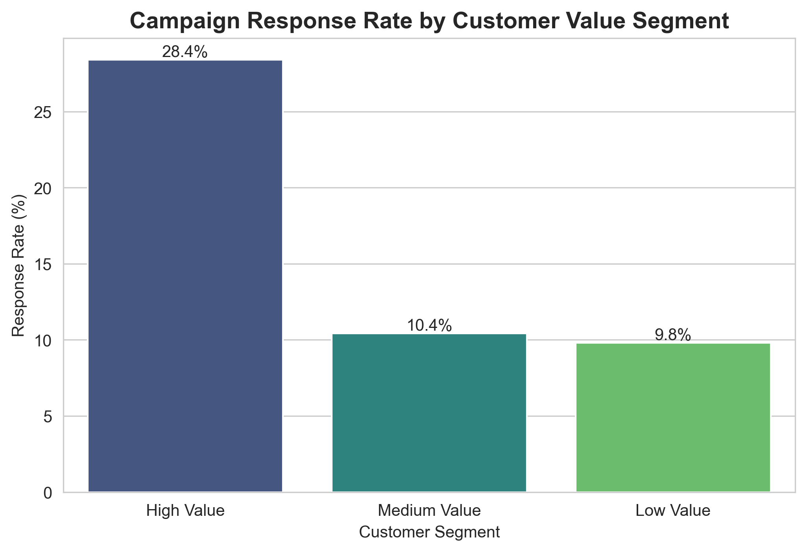
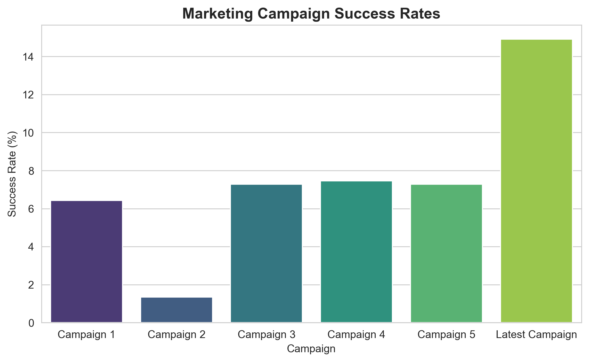
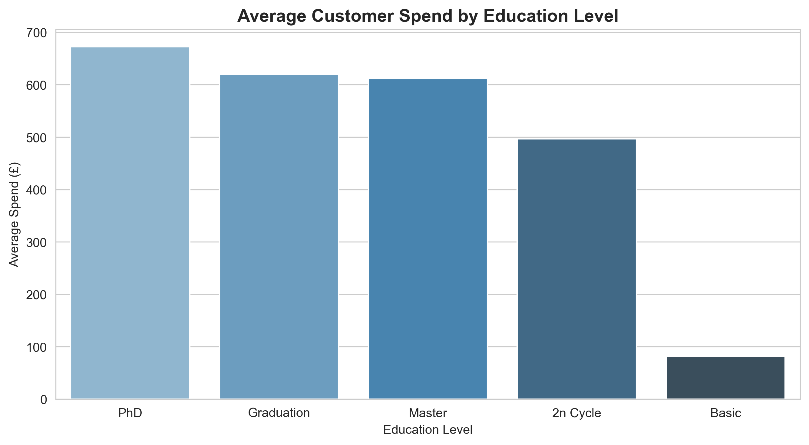
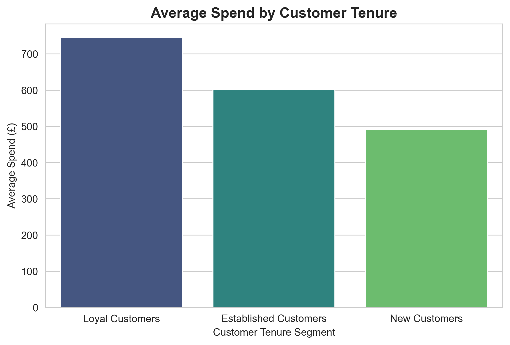

# Marketing Campaign Performance Analysis

SQL and Python data analysis project examining customer spending behaviour and marketing campaign effectiveness for an e-commerce business.

The goal of the analysis is to understand which customer segments generate the most revenue, how successful past marketing campaigns have been, and whether recent campaigns are effectively targeting high-value customers.

The project combines **SQL for data querying and aggregation** with **Python for analysis and visualisation**.

---

# Project Overview

This project analyses a dataset of **2,240 customers** containing demographic information, household characteristics, purchasing behaviour, and responses to multiple marketing campaigns.

The analysis focuses on identifying:

- High-value customer segments
- Marketing campaign effectiveness
- Spending patterns across demographic groups
- The relationship between customer tenure and spending behaviour

Insights from the analysis can help inform **marketing targeting strategies and customer retention initiatives**.

---

# Analytical Workflow

This project follows a typical end-to-end analytics workflow used in real business environments:

1. **Data Exploration**
   - Loaded and inspected the customer dataset
   - Identified key demographic, household and marketing response variables

2. **Feature Engineering**
   - Created derived variables including:
     - Customer value segments
     - Household types (children vs no children)
     - Customer tenure segments
   - Calculated total customer spend

3. **SQL Analysis**
   - Used SQL queries to aggregate customer behaviour metrics
   - Generated segment-level metrics such as:
     - Average spend
     - Total revenue
     - Campaign response rates

4. **Python Analysis**
   - Loaded SQL outputs into Pandas
   - Performed additional analysis and segmentation

5. **Data Visualisation**
   - Built visualisations using Seaborn and Matplotlib to highlight key insights

6. **Business Interpretation**
   - Translated analytical findings into marketing strategy recommendations

---

# Skills Demonstrated

- SQL aggregation and segmentation analysis
- Python data analysis with Pandas
- Data visualisation using Seaborn and Matplotlib
- Feature engineering and customer segmentation
- Translating data insights into business recommendations

---

# Key Visualisations

## Campaign Response Rate by Customer Value Segment

High-value customers showed a dramatically higher response rate (28.4%) to the latest campaign compared with medium-value (10.4%) and low-value customers (9.8%).  

This suggests marketing efforts are effectively reaching the most profitable customers.

---

## Marketing Campaign Success Rates

The latest marketing campaign achieved the highest response rate (14.9%), significantly outperforming earlier campaigns. Campaign 2 performed notably worse than the others, suggesting potential issues with targeting or messaging.

---

## Average Customer Spend by Education Level

Customers with PhD-level education recorded the highest average spend, although graduates generated the largest overall revenue due to their larger customer base.

---

## Average Spend by Customer Tenure

Customers with longer tenure generate significantly higher average spending. Loyal customers spend considerably more than newer customers, indicating that **customer retention plays a key role in long-term revenue generation**.

---

# Key Business Insights

1. **High-value customers respond strongly to marketing campaigns**  
   Customers spending over £1000 responded nearly three times more often to the latest campaign than lower-value customers.

2. **The most recent campaign was the most effective**  
   With a response rate of 14.9%, the latest campaign significantly outperformed previous campaigns.

3. **Customers without children generate higher spending**  
   Households without children showed substantially higher average spend and overall revenue despite representing a smaller portion of the customer base.

4. **Customer tenure strongly correlates with spending behaviour**  
   Loyal customers spend far more than newer customers, highlighting the importance of retention strategies.

5. **Higher education levels show higher average spending**  
   While graduates represent the largest customer group, PhD customers recorded the highest average spend.

---

# Business Recommendations

Based on the analysis, the following strategic recommendations can be made:

- **Prioritise high-value customers in marketing campaigns**, as they demonstrate significantly higher response rates.
- **Investigate the performance of Campaign 2**, which underperformed compared to other campaigns.
- **Invest in customer retention initiatives**, as long-tenure customers generate higher lifetime value.
- **Consider targeted marketing for higher-spending demographic segments**, particularly customers without children.
- Maintain separate strategies for **high-spend customers and large customer groups**, as the largest segments are not always the most profitable per customer.

---
